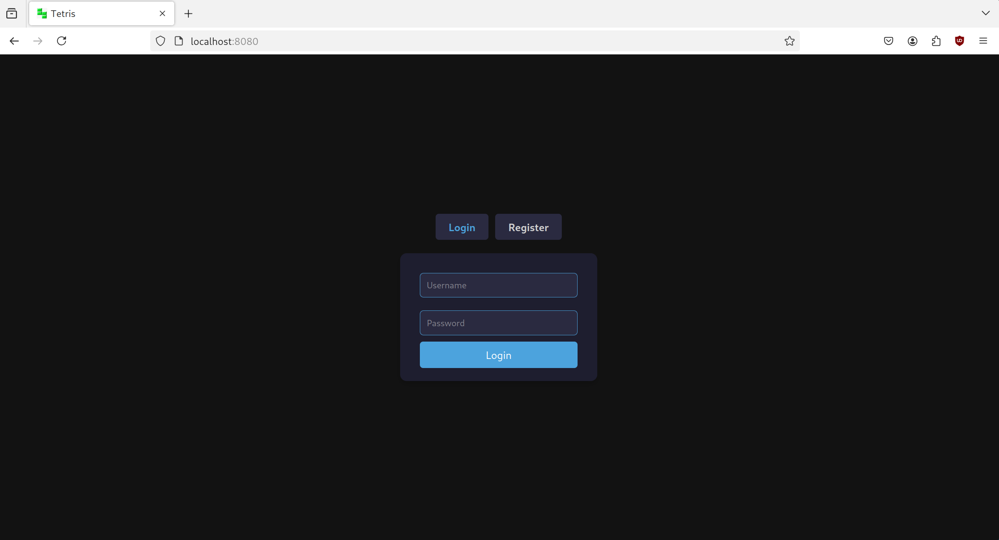
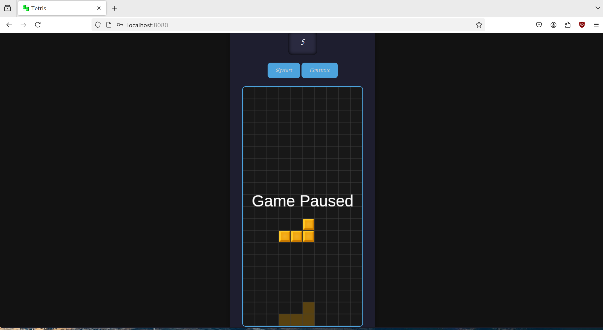

# http-server
HTTP server implementation from scratch

## Description
This project implements a basic HTTP server in C. It serves static files and handles HTTP requests, making it a foundational project for learning how web servers work at a low level. The server is designed to process HTTP GET requests, serve files from a specific directory, and respond with appropriate HTTP status codes.

There are two parts to this project:
1. The server
2. The client

To make things more interesting, I've wrote the tetris game using Javascript, HTML and CSS (all from scratch, no JS frameworks, no CSS frameworks, no bullshit). The server serves the game to the client (the browser), which can then be played. To play the game, open the browser and navigate to `http://localhost:8080/`, you have to create an account to play the game.

## Features
- Serves static files such as index.html, images (.png, .jpeg), JSON, and other resources from a designated directory.
- Handles HTTP GET/POST requests, parsing headers and determining MIME types.

## Usage
1. Clone the repository:
```bash
git clone https://github.com/sanchezhs/http-server.git
```

2. Compile the server:
```bash
cd http-server
make
```

3. Run the server, you can specify the port number or use the default port 8080:
```bash
./build/server <port>
```

4. Open a browser and navigate to `http://localhost:8080/` to play the game.

## Requirements
- cJSON: A JSON parser in C. You can find it [here](https://github.com/DaveGamble/cJSON).
- SQLite3: A C-language library that implements a SQL database engine. You can find it [here](https://www.sqlite.org/index.html).

## Examples




## TODO
Add support for:
- PUT
- DELETE
